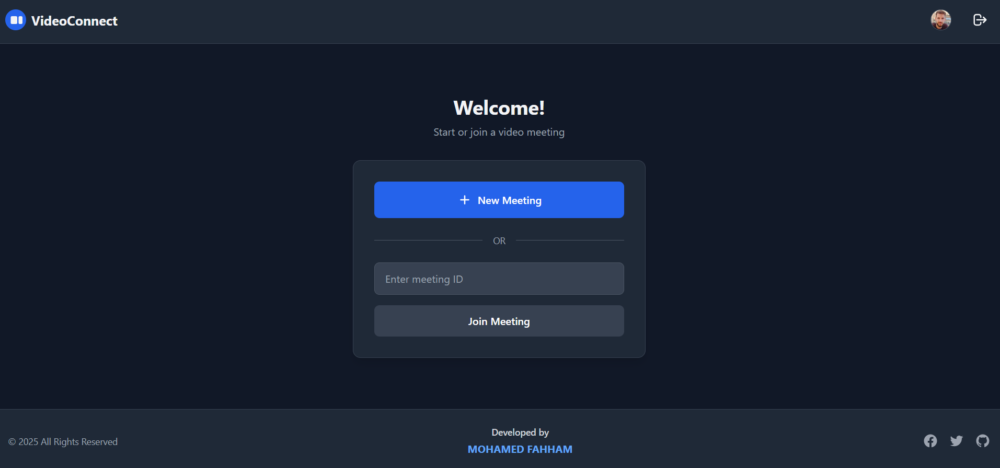
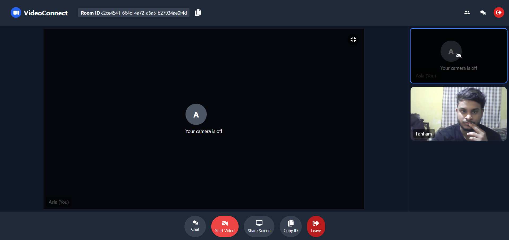
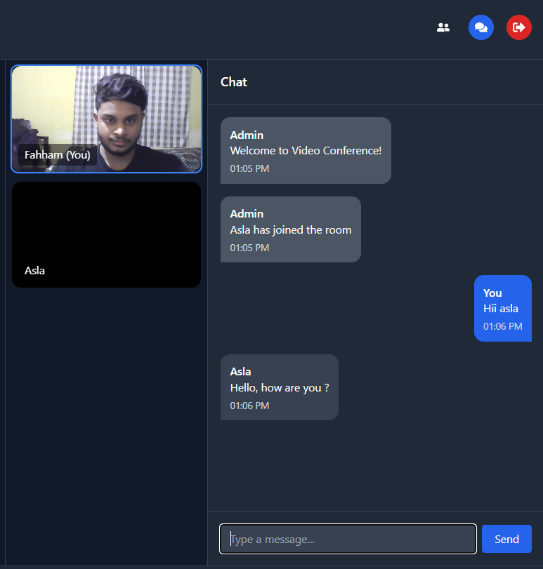
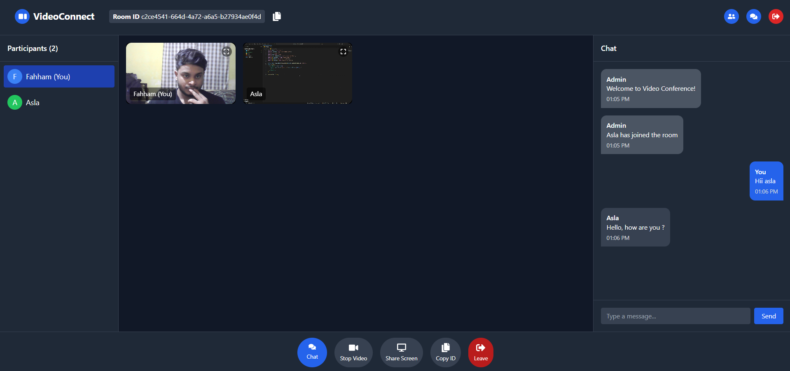

# Zoom-Clone-WebRTC
# Video Conference App with WebRTC

## App Screenshots

A real-time video conferencing application built with React, Node.js, and WebRTC that allows users to:
- Create/join rooms
- Video/audio chat
- Screen share
- Text chat
- Stop/play video controls

## Features

🎥 **Real-time video calls** using WebRTC  
🎤 **Video controls** (stop/play)  
🖥️ **Screen sharing**  
💬 **In-call chat messaging**  
🔒 **Room-based access control**  
👥 **Multi-participant support**  
📱 **Responsive design**  

## Tech Stack

**Client**:
- React.js
- Redux (state management)
- Tailwind CSS (styling)
- Socket.IO (real-time communication)
- Simple-Peer (WebRTC implementation)

**Server**:
- Node.js
- Express.js
- Socket.IO
- MongoDB (user data)
- JWT (authentication)

## Installation

### Prerequisites
- Node.js (v14+)
- MongoDB
- npm/yarn

### Server Setup

   1. cd server
   2. npm install
   3. npm start

### Client Setup
 
   1. cd client
   2. npm install
   3. npm start
